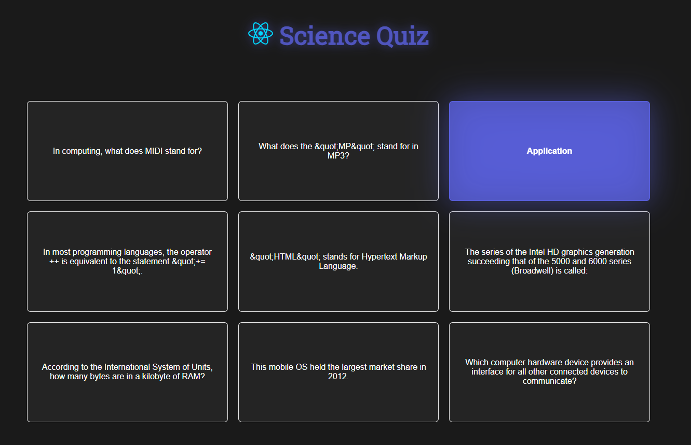

## Science Quiz

A simple quiz application built with React and Axios that fetches questions from the Open Trivia Database API. The app allows users to answer questions from the "Science" category with an easy difficulty level.

## Features

**Fetch Questions from API:** The app fetches questions using the Open Trivia Database API

**Question Display:** Questions are displayed as flashcards.

**Retry Button:** In case of an error, the user can retry fetching questions by clicking the "Retry" button.

## Technologies:

- **React** – For building the user interface.
- **Axios** – For making HTTP requests.

## Screenshots

